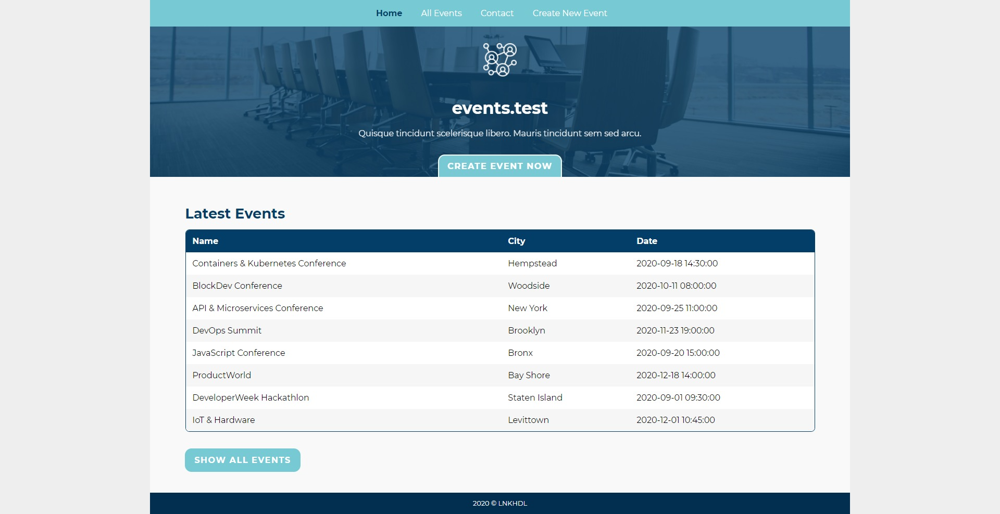
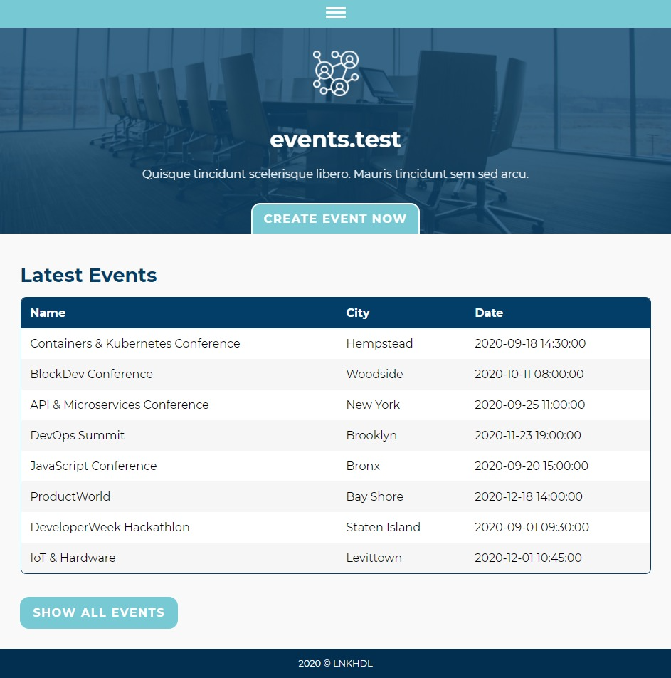
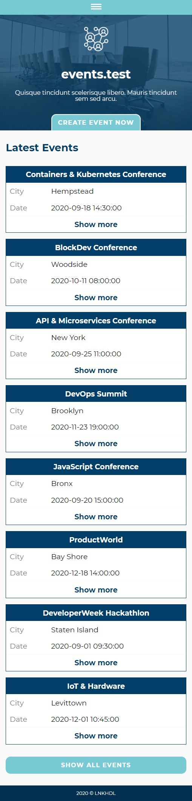
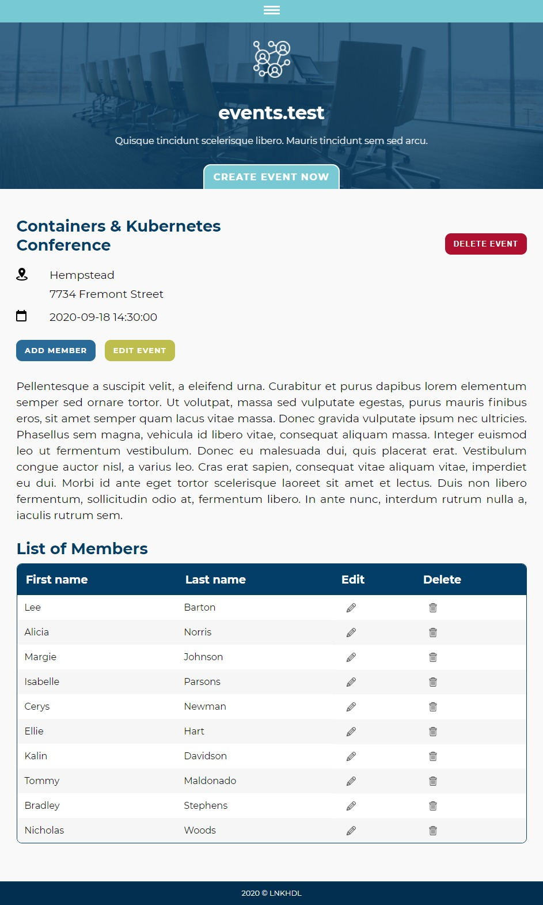
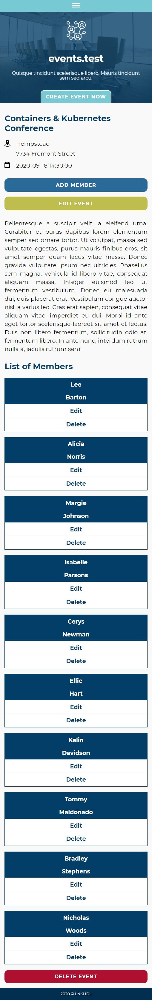

## PHP Events

This is my first project in PHP. It was created for learning purpose only. Therefore, it is not production ready.

* No frameworks or libraries were used, except for testing.
* Main structure contains: Controllers, Services, Mappers and Entities.
* Data validation is done based on custom rules which can be easily extended.
* Custom errors and exceptions handling.
* Vanilla HTML, CSS/SCSS and JS.
* Codeception is used for unit, integration, UI and API tests.

### Configuration
1. Create a new MySql database. `demo_data.sql` demo data script located in `config` folder can be used to create the database and test data.
1. Copy `database_example.php` file that is located in `config` folder.
1. Rename it to `database.php`.
1. Change database credentials in it.
1. Change `$env` variable in `index.php` file that is located in `public` folder to the required environment type based on the `$env_options`.

### Screenshots

